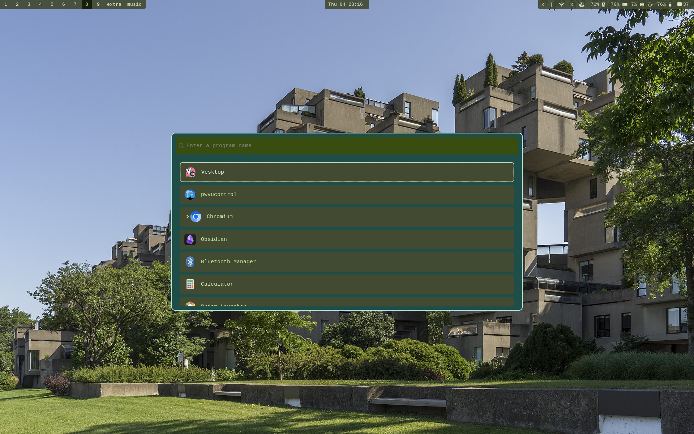
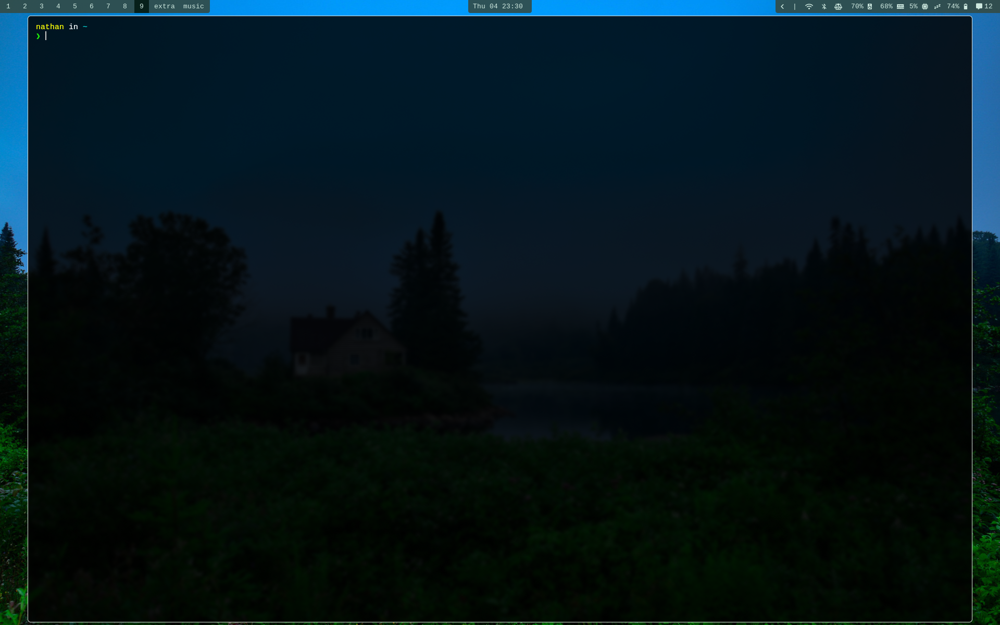
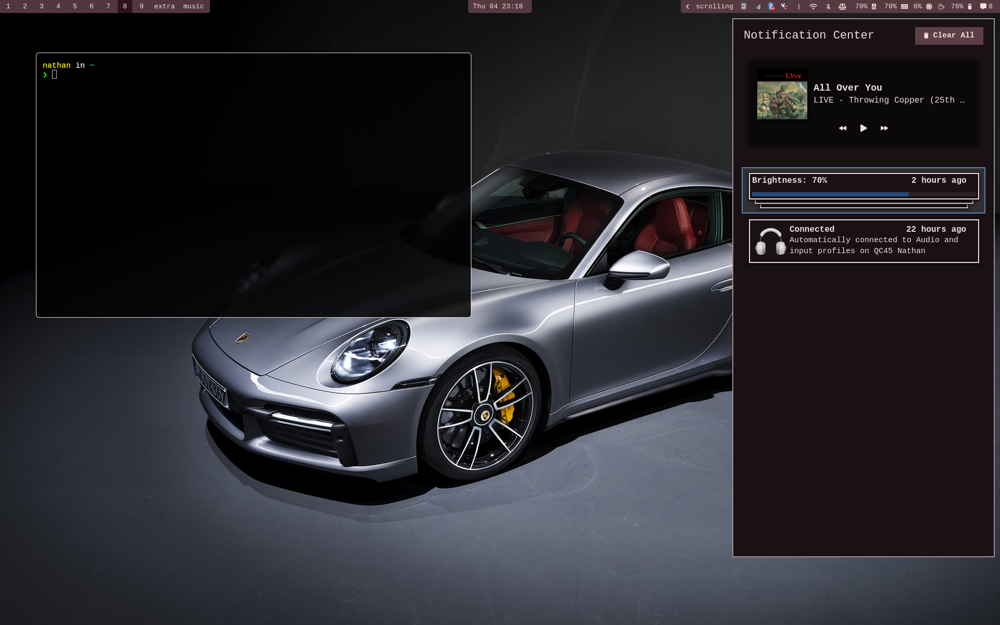

# Arch linux dotfiles

My day to day dotfiles!

My window manager is hyprland set in scrolling layout.

Colors are generated by matugen.

I use [this](https://wiki.archlinux.org/title/Dotfiles) guide to configure dotfiles

## Install

To clone the repo use this command:

```bash
git clone --bare $git@github.com:nath1416/dotfiles.git <destination>
dot checkout
dot config --local status.showUntrackedFiles no
```

## Pictures




